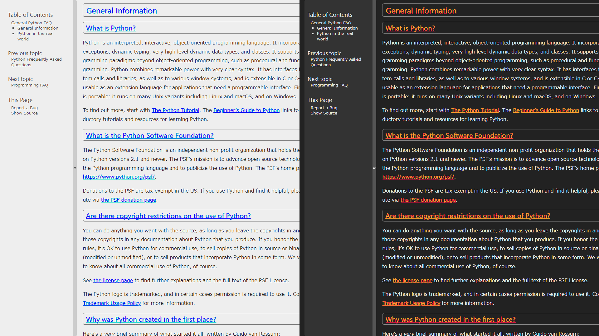

# stylus-css

Custom stylesheets using the Google chrome extension Stylus are saved and published.

## How to Stylus

- link: Site <https://userstyles.world/>
- link: Wiki <https://github.com/openstyles/stylus/wiki>
- Chrome Web Store: <https://chrome.google.com/webstore/detail/stylus/clngdbkpkpeebahjckkjfobafhncgmne>

## How to use

1. Install Stylus
2. Select the style you want to use
3. Click the "Install" button in the lower right corner

### CSS

- [docs.python.org](css/docs-python-org/)
  - UserStyles.world: <https://userstyles.world/style/4676>
    
